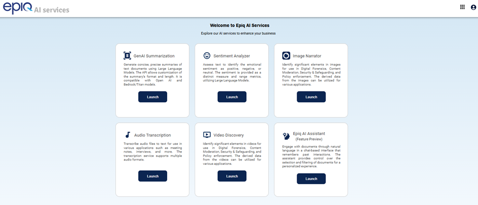
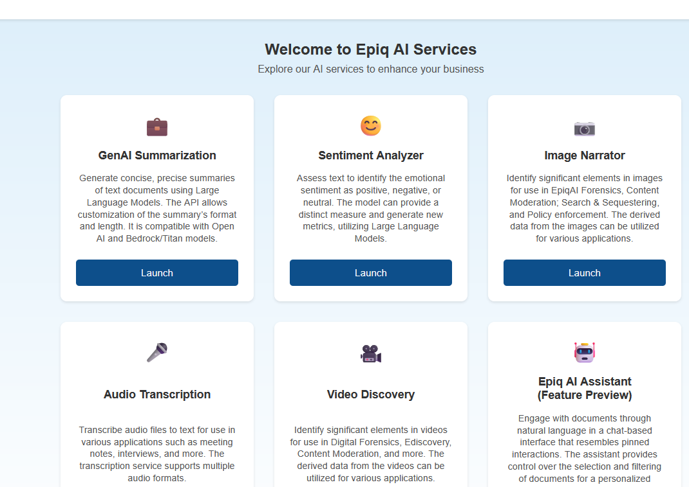
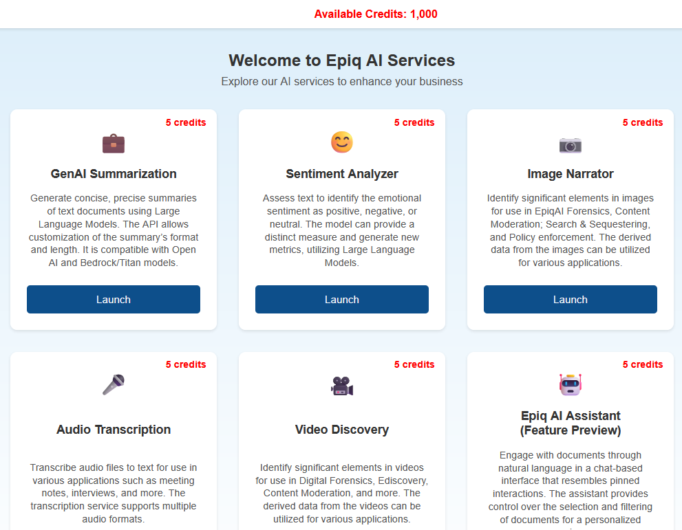

We’re considering a plan to sell these AI Agents in a credit model. Basically customers can buy credits and AI Agent use draws down against that purchase.

Because I’m the Product Manager, I was asked to create an example of what the UX should look like and the relevant JIRA / DevOps Epics, Stories and User Acceptance Criteria.

Instead of adding GenAI to the PM process and tools, I went GenAI native and created a completely new process:
•	Prompt 1 – Use GenAI to create an HTML file out of the screenshot
•	Prompt 2 – Use GenAI to refine the generated HTML to make the changes I wanted
•	Prompt 3 – Use GenAI to create the Epics, Stories and User Acceptance Criteria based on the user visual differences between the two HTML files it generated

By being GenAI native and create a new workflow to meet the request, I delivered everything the teams needed in less than 2 hours.

I started by taking a screenshot:

Of the current page and copying it into my GenAI tool with prompt: PROMPT 1 pohagan72/Prompt_Library/GenAI_Management_Console_UX_Update/Prompt1.md

It took a few turns with my GenAI tool of choice but eventually I got this representation that was more than good enough: 

Then using GenAI I refined the generated HTML to make the changes I wanted with PROMPT 2: pohagan72/Prompt_Library/GenAI_Management_Console_UX_Update/Prompt2.md

And with that, I was able use GenAI to create the Epics, Stories and User Acceptance Criteria with PROMPT 3: pohagan72/Prompt_Library/GenAI_Management_Console_UX_Update/Prompt 3.md

